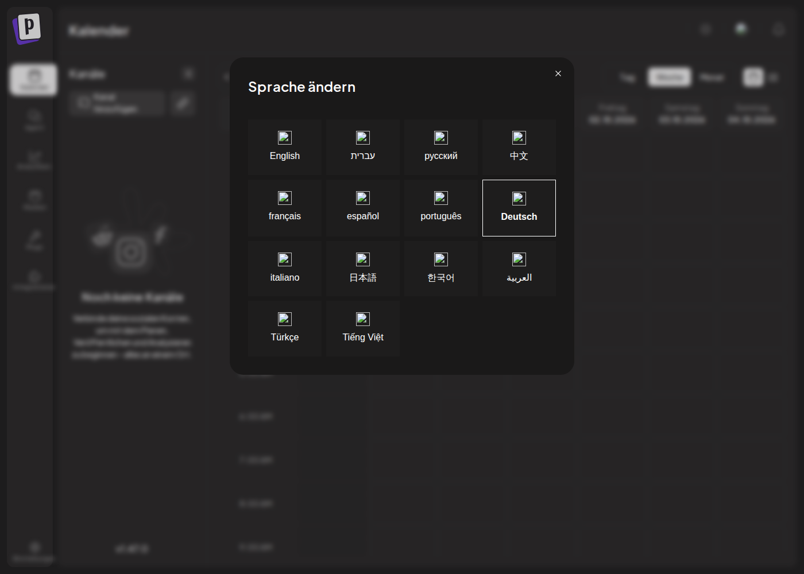
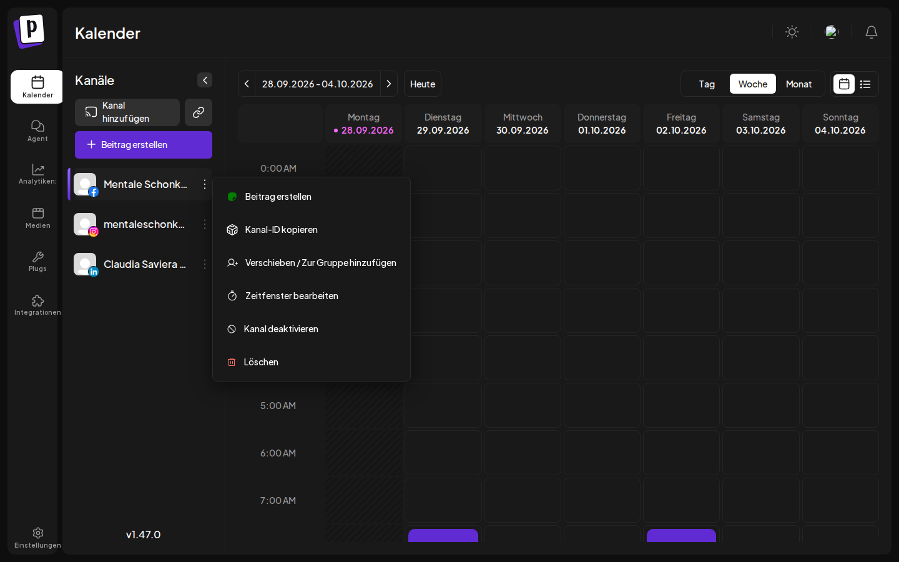
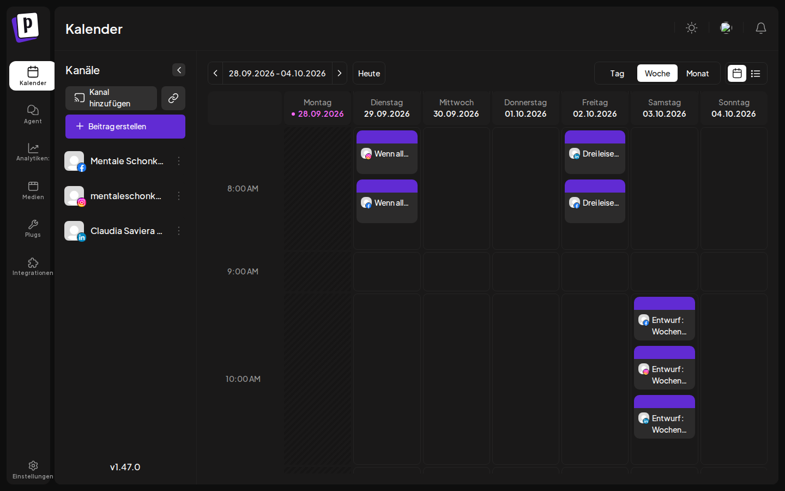
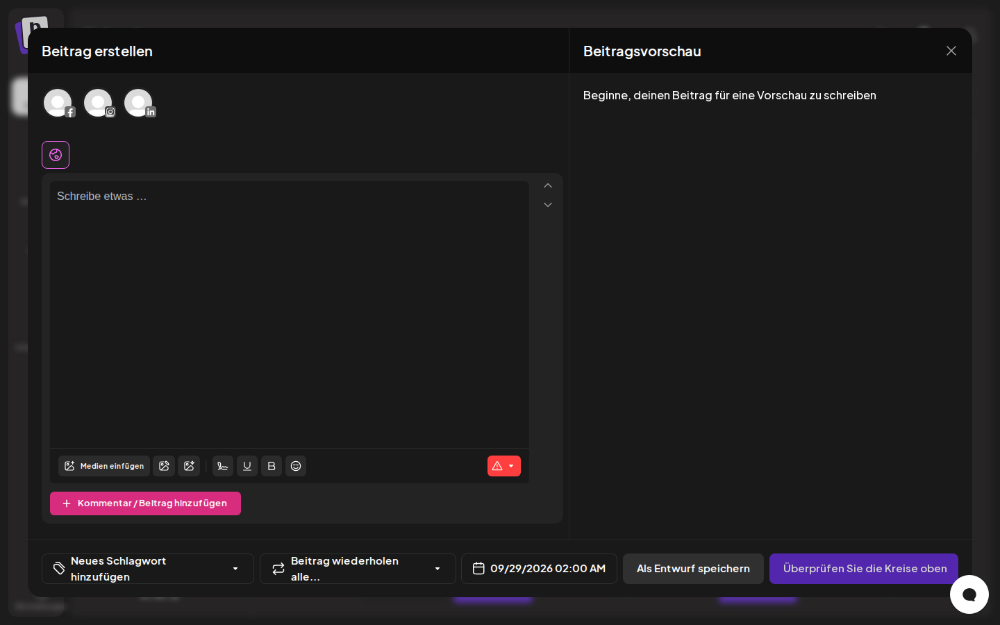

# Postiz – dein Social-Media-Manager 🌙

Eine Anleitung in einfachen Schritten. Du brauchst kein Technik-Wissen – nur Kopieren & Einfügen.

**Was Postiz für dich tut:** Du schreibst deine Posts in Ruhe vor (z. B. sonntags für die ganze Woche), und Postiz veröffentlicht sie pünktlich auf Instagram, Facebook, LinkedIn, Threads, YouTube, TikTok, Pinterest, Bluesky und vielen weiteren – alles aus einem Kalender. Kostenlos und auf deinem eigenen Server, deine Daten gehören dir.

---

## Inhalt

1. [Die wichtigste Entscheidung: Wo läuft Postiz?](#1-wo-läuft-postiz)
2. [Installation](#2-installation)
3. [Erster Start: Konto anlegen](#3-erster-start)
4. [Social-Media-Kanäle verbinden](#4-kanäle-verbinden)
5. [Postiz im Alltag benutzen](#5-postiz-im-alltag)
6. [Automatisieren](#6-automatisieren)
7. [Dein Wochen-Rhythmus (Vorschlag)](#7-dein-wochen-rhythmus)
8. [Sicherung & Updates](#8-sicherung--updates)
9. [Wenn etwas nicht klappt](#9-wenn-etwas-nicht-klappt)
10. [Spickzettel](#10-spickzettel)
11. [Was an dieser Installation optimiert ist](#11-was-optimiert-ist)

---

## 1. Wo läuft Postiz?

Postiz muss **rund um die Uhr** laufen, damit geplante Posts pünktlich rausgehen. Außerdem verlangen Instagram, Facebook, LinkedIn & Co. eine **echte Internet-Adresse mit https://**, bevor sie sich verbinden lassen.

| Möglichkeit | Kosten | Geeignet für |
|---|---|---|
| **A · Eigener kleiner Server** ⭐ empfohlen | ca. 5–8 €/Monat | Echter Betrieb: läuft immer, alle Plattformen funktionieren |
| **B+ · Laptop + Cloudflare-Tunnel** | 0 € | Wie B, aber mit echter https-Adresse → **alle Plattformen** lassen sich verbinden. Posts gehen raus, solange der Laptop an ist. |
| B · Auf deinem Computer | 0 € | Zum Ausprobieren und Kennenlernen. Posts gehen nur raus, solange der Rechner an ist. Instagram/Facebook/LinkedIn lassen sich hier meist **nicht** verbinden (sicher klappen Bluesky, Mastodon, Telegram, Discord). |
| C · Postiz-Cloud (postiz.com) | ab ca. 29 $/Monat | Wenn du dich um gar nichts kümmern willst. Die Automatisierung aus Kapitel 6 funktioniert dort genauso. |

**Mein Rat:** Starte mit **B**, um Postiz in Ruhe kennenzulernen (30 Minuten). Wenn es dir gefällt → **A**.

**Was du für A brauchst:**
- einen Server mit **mindestens 4 GB Arbeitsspeicher**, z. B. *Hetzner Cloud CX22* oder *netcup VPS 1000* (Betriebssystem: **Ubuntu 24.04**)
- eine Subdomain deiner Website, z. B. `social.mentaleschonkost.de`

---

## 2. Installation

### Variante B – auf deinem Computer (zum Kennenlernen)

1. **Docker Desktop** installieren: <https://www.docker.com/products/docker-desktop/> → herunterladen, installieren, öffnen. Warten, bis unten links „Engine running" steht.
2. Dieses Projekt herunterladen: Auf GitHub im Repository auf den grünen Knopf **„Code" → „Download ZIP"**, entpacken. (Solange die Postiz-Dateien noch nicht im Hauptzweig sind, vorher oben links den Zweig `claude/sleepy-wright-0l9p9h` auswählen.)
3. **Terminal** öffnen (Mac: `Cmd + Leertaste` → „Terminal"; Windows: „PowerShell" – dort zuerst `wsl` eingeben) und eintippen:
   ```bash
   cd ~/Downloads/claudia-noack-workspace-main/postiz
   ./setup.sh
   ```
   Tipp: Heißt der Ordner bei dir anders, tippe `cd ` (mit Leerzeichen) und **ziehe den Ordner `postiz` einfach ins Terminal-Fenster** – der Pfad wird automatisch eingefügt. Dann Enter.
4. Beim ersten Mal dauert es 5–10 Minuten. Wenn **„Postiz ist bereit!"** erscheint: <http://localhost:4007> im Browser öffnen.

### Variante B+ – Laptop mit eigener https-Adresse (kostenlos, über Cloudflare-Tunnel)

So klappen auch Facebook, Instagram & LinkedIn – ohne Server. Voraussetzung: deine Domain liegt bei Cloudflare.
**Wichtig:** Posts gehen nur raus, solange der Laptop an ist, Docker Desktop läuft und er nicht schläft.

1. **Tunnel anlegen:** Cloudflare-Dashboard → *Zero Trust* (bzw. *Networking*) → **Tunnels → „Tunnel erstellen"** → Typ **Cloudflared** → Name `postiz-laptop` → Umgebung **Docker** wählen → den angezeigten Befehl (`docker run … --token eyJ…`) **kopieren** (noch nicht ausführen).
2. **Adresse zuweisen** (nächste Seite, „Öffentlicher Hostname"): Subdomain `some`, Domain `mentale-schonkost.de`, Typ **HTTP**, URL **`postiz:5000`** → Speichern.
   Meldet Cloudflare, dass es den Eintrag schon gibt: den alten `some`-Eintrag unter *DNS* löschen und nochmal speichern.
3. **Auf dem Laptop** (Docker Desktop läuft) im Ordner `postiz`:
   ```bash
   ./setup.sh --tunnel some.mentale-schonkost.de
   ```
   Bei „Tunnel-Token einfügen" den kopierten Befehl einfügen (es wird nichts angezeigt – das ist Absicht) → Enter.
4. Nach „Postiz ist bereit!" **sofort** https://some.mentale-schonkost.de öffnen und dein Konto anlegen.
5. **Laptop wach halten:** Mac → Systemeinstellungen → Batterie/Energie → „Automatischen Ruhezustand verhindern, wenn Bildschirm aus ist" (am Netzteil). Docker Desktop → Einstellungen → „Start Docker Desktop when you sign in".

> Große Videos: Über den kostenlosen Tunnel gehen Uploads bis 100 MB.

### Variante A – auf deinem Server (für den Dauerbetrieb)

**Schritt 1 – Server mieten.** Bei Hetzner: „Cloud" → „Server hinzufügen" → Standort Deutschland, **Ubuntu 24.04**, Typ **CX22**. Du bekommst eine **IP-Adresse** (z. B. `95.217.12.34`) und ein Passwort per E-Mail.

**Schritt 2 – Subdomain einrichten.** Bei deinem Domain-Anbieter (IONOS, Strato, all-inkl …) im DNS-Bereich einen **A-Eintrag** anlegen:
- Name: `social`
- Wert: die IP-Adresse des Servers

(Das kann bis zu 1 Stunde dauern, bis es wirkt.)

**Schritt 3 – Einloggen und installieren.** Im Terminal (Passwort aus der Hetzner-Mail):
```bash
ssh root@95.217.12.34
```
Dann auf dem Server nacheinander:
```bash
curl -fsSL https://get.docker.com | sh
git clone https://github.com/mentaleschonkost/claudia-noack-workspace.git
cd claudia-noack-workspace/postiz
# Falls "No such file or directory": Postiz ist noch nicht im Hauptzweig →
#   cd claudia-noack-workspace && git checkout claude/sleepy-wright-0l9p9h && cd postiz
./setup.sh --server social.mentaleschonkost.de
```
Fertig. Postiz holt sich automatisch ein Sicherheitszertifikat. Öffne **https://social.mentaleschonkost.de**.

> 🔒 Ist dein GitHub-Repository **privat**, fragt `git clone` nach Benutzername und Passwort: Als Passwort einen *Personal Access Token* verwenden (GitHub → Settings → Developer settings → Tokens).

> 💡 **Firewall:** In der Hetzner-Konsole bei „Firewalls" nur die Ports **22, 80 und 443** freigeben.

---

## 3. Erster Start

1. Adresse öffnen → Seite **„Sign Up"** → Email, Password und bei *Company* „Mentale Schonkost" eintragen → **„Create Account"**. (Den Google-Knopf ignorieren.)
   Das ist **dein** Konto. Danach ist die Registrierung automatisch gesperrt – niemand Fremdes kann sich ein Konto anlegen.
2. Das Willkommens-Fenster „Connect Your Channels" kannst du erst mal mit **„Continue without channels"** schließen.
3. **Auf Deutsch umstellen:** oben rechts auf das **Flaggen-Symbol** (zwischen Sonne und Glocke) → **Deutsch**.

   

4. **Zeitfenster festlegen** (sobald ein Kanal verbunden ist – wichtig für die Automatik!): Links in der Kanal-Liste neben dem Kanal auf **⋮** → **„Zeitfenster bearbeiten"** → deine Lieblingszeiten, z. B. 08:30, 12:00, 18:30. Ohne das schlägt Postiz nachts um 2 Uhr vor.

   

---

## 4. Kanäle verbinden

Links auf **„Kanal hinzufügen"** klicken und Plattform wählen.

**Ohne Vorbereitung** (sofort): **Bluesky** (App-Passwort unter Einstellungen → Datenschutz → App-Passwörter), **Mastodon**, **Telegram**, **Discord**.

**Mit einmaliger Vorbereitung:** Die großen Plattformen verlangen, dass du eine eigene kleine „App" bei ihnen registrierst. Das ist ein einmaliger Aufwand von ca. 20 Minuten pro Plattform. Du bekommst dabei zwei Werte (ID + Geheimnis), die du in die Datei `.env` einträgst.

**Überall gleich:** Als **Weiterleitungs-URL / Redirect-URI / Callback-URL** trägst du ein:
```
https://social.mentaleschonkost.de/integrations/social/<plattform>
```
also z. B. `…/integrations/social/instagram`, `…/integrations/social/linkedin`, `…/integrations/social/facebook`.

| Plattform | Wo registrieren | In `.env` eintragen |
|---|---|---|
| **Instagram + Facebook** | <https://developers.facebook.com/apps> → „App erstellen" → Typ „Business". Produkte „Facebook Login for Business" und „Instagram Graph API" hinzufügen. | `FACEBOOK_APP_ID`, `FACEBOOK_APP_SECRET` |
| Instagram ohne Facebook-Seite | Gleiche App, Produkt „Instagram API with Instagram Login" | `INSTAGRAM_APP_ID`, `INSTAGRAM_APP_SECRET` |
| Threads | Gleiche Meta-App, Produkt „Threads API" | `THREADS_APP_ID`, `THREADS_APP_SECRET` |
| **LinkedIn** | <https://www.linkedin.com/developers/apps> → „Create app" → Produkte „Share on LinkedIn" + „Sign In with LinkedIn using OpenID Connect" | `LINKEDIN_CLIENT_ID`, `LINKEDIN_CLIENT_SECRET` |
| YouTube | <https://console.cloud.google.com> → Projekt → „YouTube Data API v3" aktivieren → OAuth-Client (Web) | `YOUTUBE_CLIENT_ID`, `YOUTUBE_CLIENT_SECRET` |
| Pinterest | <https://developers.pinterest.com/apps> | `PINTEREST_CLIENT_ID`, `PINTEREST_CLIENT_SECRET` |
| TikTok | <https://developers.tiktok.com> (Freigabe dauert einige Tage) | `TIKTOK_CLIENT_ID`, `TIKTOK_CLIENT_SECRET` |

Ausführliche Bild-für-Bild-Anleitungen je Plattform (englisch): <https://docs.postiz.com/providers>

**Werte eintragen** – auf dem Server:
```bash
cd ~/claudia-noack-workspace/postiz
nano .env          # Werte eintragen · Speichern: Strg+O, Enter · Beenden: Strg+X
docker compose --profile https up -d      # Postiz übernimmt die neuen Werte
```

> ⚠️ **Meta (Instagram/Facebook):** Solange deine Meta-App im „Entwicklungsmodus" ist, kannst du nur mit deinem eigenen Konto posten – das reicht für dich völlig. Instagram muss ein **Business- oder Creator-Konto** sein.

---

## 5. Postiz im Alltag



- **Kalender** (Startseite): oben Tag / Woche / Monat umschalten. Auf einen freien Platz klicken = neuer Post zu diesem Zeitpunkt.
- **Post erstellen:** lila Knopf **„Beitrag erstellen"** →
  1. oben die **Kanal-Bildchen** anklicken, auf denen der Post erscheinen soll (mehrere möglich)
  2. Text bei „Schreibe etwas …" eintippen, **„Medien einfügen"** für Bilder/Videos
  3. unten das **Datum/Uhrzeit** wählen
  4. **„Zum Kalender hinzufügen"** (oder „Als Entwurf speichern")

  

  - Für jede Plattform kannst du den Text **anpassen** (im Editor auf das Kanal-Bildchen klicken) – z. B. auf LinkedIn länger, auf Instagram mit Hashtags.
  - **„Kommentar / Beitrag hinzufügen"** = erster Kommentar (ideal für Hashtags) bzw. Thread.
  - **„Beitrag wiederholen"** = derselbe Post wiederkehrend, z. B. jeden Monat dein Workshop-Hinweis.
  - Die **Beitragsvorschau** rechts zeigt, wie es auf der Plattform aussieht. Rote Warnung im Editor = da fehlt noch etwas (z. B. Instagram braucht immer ein Bild).
- **Entwürfe:** tauchen im Kalender mit „Entwurf:" auf, bis du sie öffnest und einplanst.
- **Verschieben:** Post im Kalender einfach per Drag & Drop auf einen anderen Tag ziehen.
- **Signaturen** (Einstellungen → Signaturen): Deinen Standard-Abschluss einmal speichern, z. B. „🌙 Mentale Schonkost · Link in der Bio" – per Klick in jeden Post einfügen.
- **Sets** (Einstellungen → Sets): Kanal-Kombinationen speichern, z. B. „Instagram + Facebook" – ein Klick statt jedes Mal einzeln auswählen.
- **KI-Assistent:** Mit einem OpenAI-Schlüssel (`OPENAI_API_KEY` in `.env`) schreibt Postiz dir Entwürfe, kürzt Texte und erstellt Bilder.
- **Statistiken:** Menüpunkt „Analytiken" links – Reichweite und Interaktionen je Kanal.

---

## 6. Automatisieren

Einmalig: den **API-Schlüssel** holen. In Postiz links unten **Einstellungen → Developers** → bei „API Key" auf **„Kopieren"**. Behandle ihn wie ein Passwort.

### 6.1 Den ganzen Wochenplan aus Excel einspielen ⭐

Du planst deine Woche bequem in **Excel / Numbers / Google Tabellen** und spielst alles mit **einem Befehl** ein.

**Einmalig einrichten** (Voraussetzung: Node.js von <https://nodejs.org>, Version „LTS"):
```bash
cd postiz/automation
cp zugang.env.example zugang.env
nano zugang.env          # API-Schlüssel und Adresse eintragen
node postiz.mjs check    # → "VERBINDUNG_OK" = alles richtig
node postiz.mjs kanaele  # zeigt deine verbundenen Kanäle
```

**Tabelle:** Öffne `automation/wochenplan-vorlage.csv` in Excel. Die Spalten:

| Spalte | Bedeutung | Beispiel |
|---|---|---|
| `datum` | Tag | `06.10.2026` |
| `uhrzeit` | Uhrzeit (leer = 9:00) | `08:30` |
| `kanaele` | Plattform, Kanal-Name oder `alle` – mehrere mit Komma | `instagram,facebook` |
| `text` | Dein Post (Zeilenumbrüche erlaubt) | `Wenn alles zu viel wird …` |
| `bild` | Datei (relativ zur Tabelle) oder Link – mehrere mit `\|` | `bilder/beispiel.jpg` |
| `kommentar` | Erster Kommentar, z. B. Hashtags | `#achtsamkeit #resonanz` |
| `typ` | leer = planen · `entwurf` = nur Entwurf | `entwurf` |
| `einstellungen` | für Profis (Plattform-Optionen) | meist leer |

Speichern als **„CSV UTF-8 (durch Trennzeichen getrennt)"**. Dann:
```bash
node postiz.mjs plan meine-woche.csv --probe   # Probelauf: prüft alles, schickt nichts
node postiz.mjs plan meine-woche.csv           # wirklich einplanen
```
Vor dem Einplanen prüft das Werkzeug **alle** Zeilen: Datum in der Vergangenheit, unbekannter Kanal, fehlende Bilddatei, Instagram ohne Bild … Findet es einen Fehler, wird **gar nichts** angelegt und die Meldung nennt die Zeile. Lehnt Postiz selbst mittendrin etwas ab, sagt dir das Werkzeug, welche Zeilen schon drin sind, und wie du mit `--ab <Zeile>` weitermachst – ohne doppelte Posts.

> 📷 **Bilder:** Lege sie in den Ordner `bilder/` neben deiner Tabelle und schreibe in die Spalte nur `bilder/dateiname.jpg`. Ein Beispielbild in deinen Farben liegt schon dort. **Instagram, TikTok, YouTube und Pinterest brauchen immer ein Bild oder Video.**

### 6.2 Einzelne Posts per Befehl
```bash
node postiz.mjs post --kanal instagram --bild foto.jpg --text "Heute schon durchgeatmet? 🌙"
node postiz.mjs post --kanal linkedin --zeit "07.10.2026 12:00" --text "…"
node postiz.mjs post --kanal alle --entwurf --text "Idee für später"
node postiz.mjs liste --tage 14      # was ist geplant?
node postiz.mjs loeschen <ID>        # Post löschen
```
Ohne `--zeit` nimmt Postiz automatisch dein **nächstes freies Zeitfenster** (siehe Kapitel 3, Punkt 4).

### 6.3 Mit Claude sprechen statt klicken (MCP) ✨

Postiz lässt sich direkt mit Claude verbinden. Dann kannst du einfach schreiben:
> *„Plane für nächste Woche drei Instagram-Posts zum Thema Erschöpfung, jeweils 8:30 Uhr, im Ton meiner Website."*

**Einrichten (nur Server-Variante A):**
1. In Postiz: **Einstellungen → Developers** → Abschnitt „MCP Client Configuration" → bei *Client* **„Claude"** wählen → Adresse kopieren. Sie sieht so aus:
   ```
   https://social.mentaleschonkost.de/api/mcp-oauth-dynamic
   ```
2. In Claude: **Einstellungen → Konnektoren → Eigenen Konnektor hinzufügen** → Adresse einfügen.
3. Claude öffnet ein Fenster, in dem du dich bei Postiz anmeldest – fertig. (Dein Schlüssel steht dabei nirgends in der Adresse.)

Tipp: Lass Claude Posts zuerst als **Entwurf** anlegen und gib sie selbst im Kalender frei.

### 6.4 Blog/Newsletter automatisch teilen (RSS)
Postiz → **Automatisches Posten** → RSS-Adresse deines Blogs eintragen (z. B. `https://mentaleschonkost.de/feed`) → Kanäle wählen. Jeder neue Blogartikel wird automatisch geteilt.

### 6.5 Mit n8n / Make / Zapier verbinden
- **n8n:** fertiger Baustein „Postiz" (Community-Node `n8n-nodes-postiz`) – Server-Adresse `https://social.mentaleschonkost.de/api` + API-Schlüssel eintragen.
- **Make / Zapier:** Baustein „HTTP-Anfrage" → `POST https://social.mentaleschonkost.de/api/public/v1/posts`, Kopfzeile `Authorization: <API-Schlüssel>`.
- **Webhooks** (Einstellungen → Webhooks): Postiz meldet sich, wenn ein Post veröffentlicht wurde – z. B. um ihn automatisch in eine Tabelle einzutragen.

Beispiel-Ideen: Neues Kalenderangebot (Zoom-Workshop) → automatisch Ankündigungs-Post · Neuer Newsletter in MailerLite/Brevo → Teaser auf LinkedIn.

---

## 7. Dein Wochen-Rhythmus

Ein sanfter Vorschlag, der ca. **45 Minuten pro Woche** braucht:

| Wann | Was | Dauer |
|---|---|---|
| **Sonntag** | Wochenthema wählen, 3–5 Posts in die Excel-Vorlage schreiben (gern mit Claude als Schreibhilfe), Bilder in einen Ordner legen, `plan … --probe`, dann `plan …` | 30 Min |
| **Mo–Fr** | Nichts tun 🌙 – Postiz postet. Bei Lust: Kommentare beantworten | 0–10 Min |
| **Freitag** | In Postiz → Analytiken: Was hat berührt? Das nächste Wochenthema daraus ableiten | 5 Min |
| **Monatlich** | `./update.sh` auf dem Server (macht vorher automatisch eine Sicherung) | 2 Min |

---

## 8. Sicherung & Updates

```bash
./backup.sh                              # Sicherung → Ordner backups/
./backup.sh --restore backups/<datei>    # Sicherung zurückspielen
./update.sh                              # Sicherung + neueste Version
```
**Automatische nächtliche Sicherung** (Server, einmalig): `crontab -e` eingeben und diese Zeile einfügen:
```
0 3 * * * cd /root/claudia-noack-workspace/postiz && ./backup.sh >/dev/null 2>&1
```
Es werden automatisch die letzten 14 Sicherungen aufbewahrt.

---

## 9. Wenn etwas nicht klappt

| Problem | Lösung |
|---|---|
| Seite lädt nicht | 3 Minuten warten (Postiz startet langsam). Dann `docker compose ps` – alle sollten „healthy" sein. |
| „Docker läuft nicht" | Docker Desktop öffnen (Variante B) bzw. `systemctl start docker` (Server). |
| Kann mich nicht einloggen (lokal) | Anderen Browser nehmen (Chrome/Firefox) – Safari blockiert manchmal Logins ohne https. |
| Kanal verbinden schlägt fehl | Redirect-URL bei der Plattform genau prüfen (Kapitel 4) – kein `/` am Ende, `https://`. Nach Änderungen an `.env`: `docker compose --profile https up -d`. |
| Post fehlgeschlagen (rot im Kalender) | Post öffnen – die Fehlermeldung steht dort. Häufig: Instagram braucht immer ein Bild/Video; Zugang abgelaufen → Kanal neu verbinden. |
| „API-Schlüssel falsch" | In Postiz neu kopieren (Einstellungen → Developers) → `automation/zugang.env` |
| „Postiz startet gerade noch" | Nach einem Neustart braucht Postiz 1–2 Minuten. Kurz warten. |
| Wochenplan bricht mittendrin ab | Die Meldung sagt, welche Zeilen schon eingeplant sind. Fehler korrigieren und mit `--ab <Zeile>` weitermachen – so entsteht nichts doppelt. |
| „Zu viele Posts in einer Stunde" | `API_LIMIT` in `.env` erhöhen (Standard 60) |
| Zertifikat/HTTPS klappt nicht | Zeigt die Subdomain auf die Server-IP? Test: `ping social.mentaleschonkost.de`. Ports 80/443 offen? |
| Server-Protokoll ansehen | `docker compose logs --tail 100 postiz` |

---

## 10. Spickzettel

```bash
# im Ordner postiz:
./setup.sh                        # einrichten & starten (lokal)
./setup.sh --server <domain>      # einrichten & starten (Server)
docker compose ps                 # läuft alles?
docker compose down               # anhalten
docker compose --profile https up -d   # (wieder) starten auf dem Server
./backup.sh   /   ./update.sh

# im Ordner postiz/automation:
node postiz.mjs hilfe
node postiz.mjs check
node postiz.mjs kanaele
node postiz.mjs plan woche.csv --probe
node postiz.mjs post --kanal instagram --bild bild.jpg --text "…"
node postiz.mjs liste
```

---

## 11. Was optimiert ist

Gegenüber der offiziellen Installation:

- **Sicherheit:** Alle Passwörter werden zufällig erzeugt und liegen nur in `.env` (nie auf GitHub). Fremd-Registrierungen gesperrt. Datenbanken & interne Dienste sind von außen nicht erreichbar. Automatisches HTTPS.
- **Weniger Ressourcen:** Debug-Dienste (Temporal-Admin-Tools, Temporal-Oberfläche, Spotlight) sind entfernt bzw. nur bei Bedarf startbar → im Test belegt der ganze Stack ca. 2,3 GB Arbeitsspeicher, läuft also gut auf einem 4-GB-Server.
- **Pflegeleicht:** Log-Dateien sind begrenzt (Festplatte läuft nicht voll), Ein-Befehl-Sicherung mit Aufräumen, Update mit automatischer Vorab-Sicherung.
- **Automatisierung:** Mehr Posts pro Stunde über die API erlaubt (60 statt 30), Werkzeug für Wochenpläne aus Excel mit deutschen Datumsformaten und „Alles-oder-nichts"-Prüfung.
- **Stabilität:** Alle Dienste haben Gesundheits-Checks und starten in der richtigen Reihenfolge; nach einem Server-Neustart startet alles von selbst.
